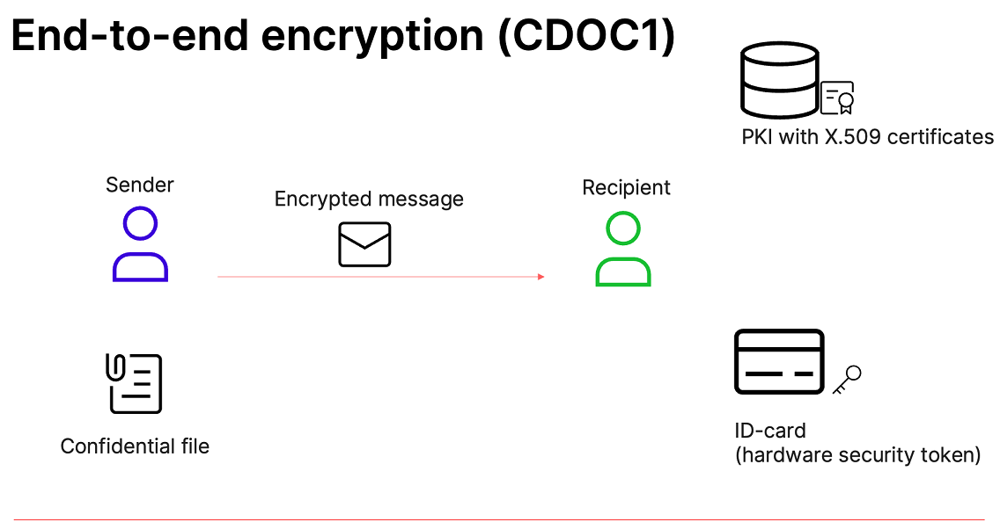
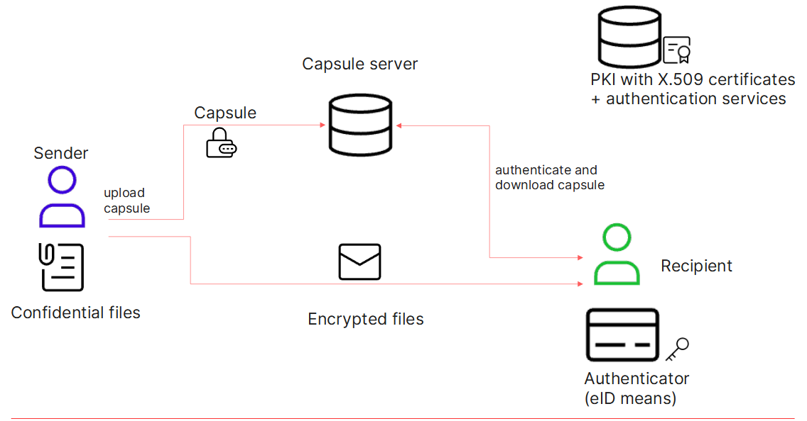

# CDOC encrypted document format
`.CDOC` is an extension used for distinguishing between encrypted DigiDoc files, which can only 
be accessed by using a secret key associated with ID-card (or other digital document’s) 
authentication certificate for specific recipients.
The CDOC format relies on a public key infrastructure (PKI), where data encrypted with a public 
key can be decrypted with a private key, and vice versa: data encrypted with a private key can 
be decrypted with a public key.

# CDOC1 usage guide

## Introduction
Platform provides the solution for document encryption/decryption in CDOC format with 
ID-card authentication certificate.
CDOC1 is an XML-ENC-based CDOC format. First five chars `"<?xml"` (ignore case).
CDOC files include an encrypted data file (XML document or another binary file (MS Word, Excel, 
PDF, RTF, etc), the recipient’s certificate, an encrypted key for decrypting the data file 
(so-called transport key) and other optional metadata. The data file is encrypted with the AES 
encryption algorithm using a 128-bit key. Several recipients (potential decrypters) can be added 
to one encrypted file – to this end, the certificates of all recipients and each recipient’s 
transport keys for encrypting the data file are added to the CDOC file.
CDOC1 encryption is not appropriate for long term file storage.



### Decryption with expired certificate:
* To decrypt documents, need exactly the same document (with the same certificates) as the 
  one that the file was encrypted with. For example, can also decrypt files with expired 
  certificates, even there is already issued a new document.
* Files that have been encrypted to earlier/expired document cannot be opened with updated 
  certificates and/or a new document.

## Prerequisites
* Java 1.8
* [Unlimited Strength Jurisdiction Policy](https://github.com/open-eid/cdoc4j/wiki/Enabling-Unlimited-Strength-Jurisdiction-Policy)

## Installation
You can use the library as a dependency from [Maven Central](https://mvnrepository.com/artifact/org.open-eid.cdoc4j/cdoc4j)
```
<dependency>
    <groupId>org.open-eid.cdoc4j</groupId>
    <artifactId>cdoc4j</artifactId>
    <version>1.5</version>
</dependency>
```

See git repository for CDOC lib [cdoc4j](https://github.com/open-eid/cdoc4j).

##  Quick start guide
Usage examples can see in [cdoc4j library](https://github.com/open-eid/cdoc4j/wiki/Examples-of-how-to-use-it).

## Testing and Debugging
CDOC1 has only unit testing, running at compile time.


# CDOC2 usage guide

## Introduction
Platform provides the solution for document encryption/decryption in CDOC 2.0 file format 
with ID-card, digital ID (such as Smart-ID smart app or SIM-based Mobile-ID ) or user password.
CDOC2 is binary that start with bytes (hex) `"43 44 4f 43 02"` (`"CDOC."`)
It is designed to encrypt data in such a way that it is decryptable to a specific user or group of users.
CDOC2 also allows to re-encrypt existing CDOC2 container but using only user password.
Encryption with password allows file long term storage.



## Prerequisites
* Java 17
* Maven 3.8.x
* Docker available and running for server scenarios (required for running tests, use 
  `-Dmaven.test.skip=true` to skip)

## Command line installation
* Download the latest version of [cdoc2-cli.jar](https://github.com/open-eid/cdoc2-java-ref-impl/packages/2223169).
* Configure it using [configuration](https://github.com/open-eid/cdoc2-java-ref-impl/blob/master/cdoc2-cli/config/localhost/localhost.properties). 
  Key store and certificates located in [Keys directoriy](https://github.com/open-eid/cdoc2-java-ref-impl/tree/master/cdoc2-cli/keys).

Or follow manual installation instruction.

### Manual installation instruction
Clone [cdoc2-java-ref-impl](https://github.com/open-eid/cdoc2-java-ref-impl) and build it for creating `cdoc2-cli-<version>.jar` manually.
Running guide is described in [cdoc2-cli/README.md](https://github.com/open-eid/cdoc2-java-ref-impl/blob/master/cdoc2-cli/README.md).
This will create `cdoc2-cli/target/cdoc2-cli-<version>.jar`.

##  Quick start guide

See [cdoc2-lib/README.md](../cdoc2-lib/README.md) for quick start how to use the `cdoc2-lib`. 

For command line usage execute encryption/decryption commands via `cdoc2-cli-<version>.jar` 
as per [cdoc2-cli/README.md](../cdoc2-cli/README.md).

## Server scenarios
For executing server scenarios you will also need to run the capsule server:
* [OpenAPI specifications](https://github.com/open-eid/cdoc2-openapi) is required for server stub generation. 
  Installing instruction is described in [README.md](https://github.com/open-eid/cdoc2-openapi/blob/master/README.md).
* [cdoc2-capsule-server](https://github.com/open-eid/cdoc2-capsule-server). Running instruction 
  is described in [getting-started.md](https://github.com/open-eid/cdoc2-capsule-server/blob/master/getting-started.md).

Capsule server module has an [admin guide](https://github.com/open-eid/cdoc2-capsule-server/blob/master/admin-guide.md)
with details for application configuration, keystore creation and monitoring.

### Server maven dependencies installation
You should configure GitHub package repository access with Personal Access Token for getting
[Open API](https://github.com/open-eid/cdoc2-java-ref-impl#maven-dependencies) and [Key 
Capsule Server](https://github.com/open-eid/cdoc2-capsule-server/blob/master/README.md#maven-dependencies)
Maven dependencies.

### Key capsule client configuration 
Server configuration can be sent in command line request via option `--server`. Property keys start 
with `cdoc2.client.server.*`. 
Local configuration example located in [localhost.properties](https://github.com/open-eid/cdoc2-java-ref-impl/blob/master/cdoc2-cli/config/localhost/localhost.properties).

### Server scenario usage example
Encrypt document with server properties and public key:

`java -jar target/cdoc2-cli-*.jar create --server=config/localhost/localhost.properties -f /tmp/localhost.cdoc -p keys/cdoc2client_pub.key README.md`

Decrypt document with server properties:

`java -jar target/cdoc2-cli-*.jar decrypt --server=config/localhost/localhost.properties -f /tmp/localhost.cdoc -o /tmp/`

`*` must be replaced with the latest version built. Example `1.4.0`.

Configuration properties for testing located in [localhost.properties](https://github.com/open-eid/cdoc2-java-ref-impl/blob/master/cdoc2-cli/config/localhost/localhost.properties).

## Use cases
All use cases are described in [CDOC2 specification](https://open-eid.github.io/CDOC2/1.1/01_use_case_model/ch03_use_cases/)

## End-user software
End-user software to create/decrypt CDOC2: https://github.com/open-eid/DigiDoc4-Client

## Testing and Debugging
Servers debugging is switched off by default. Change [get-server](https://github.com/open-eid/cdoc2-capsule-server/blob/master/get-server/config/application-local.properties#L31) 
and [put-server](https://github.com/open-eid/cdoc2-capsule-server/blob/master/put-server/config/application-local.properties#L18) 
application property `logging.level.root` from `info` to `debug` to see servers logs.

_CDOC2 has few testing tools:_
* General unit tests
* PKCS11 unit tests
* Bats tests
* Gatling load tests

### General unit tests
Tests are run within compile time.

### PKCS11 unit tests
Besides general unit tests both `cdoc2-capsule-server` and `cdoc2-java-ref-impl` have PKCS11 
unit tests with tag `pkcs11`, which are disabled at compile time and can be run separately only 
with PKCS11 hardware device (smart card, usb token). The device and its details can be 
configured using a property file [pkcs11-test-idcard.properties](https://github.com/open-eid/cdoc2-java-ref-impl/blob/master/cdoc2-lib/src/test/resources/pkcs11-test-idcard.properties).

### Bats tests
Tests can be run manually from `cdoc2-java-ref-impl` module. For running follow instruction in 
[README.md](https://github.com/open-eid/cdoc2-java-ref-impl/blob/master/test/README.md).
Bats tests have test vectors with already generated CDOC2 documents samples and testing their 
successful decryption. It is required to ensure that new changes won't brake previously 
encrypted documents and still can decrypt them. At the same time there are tests which create new 
encrypted CDOC2 documents and also test their successful decryption.

### Gatling load tests
Load tests are located in [cdoc2-gatling-tests](https://github.com/open-eid/cdoc2-gatling-tests) 
module.
Get/Put servers must be running for load tests execution. Follow description in [README.md](https://github.com/open-eid/cdoc2-gatling-tests/blob/master/README.md).
Gatling tests are running at CI pipeline.

### Establish versioning
Each module/submodule has its own independent semantic versioning `MAJOR.MINOR.PATCH`.
* MAJOR version when you make incompatible API changes
* MINOR version when you add functionality in a backward compatible manner
* PATCH version when you make backward compatible bug fixes

Additional label `-SNAPSHOT` is added for pre-release and build metadata as an extension to the 
`MAJOR.MINOR.PATCH` format.
More details in [VERSIONING.md](https://github.com/open-eid/cdoc2-java-ref-impl/blob/master/VERSIONING.md).

### Monitoring
`cdoc2-capsule-server` has a monitoring tool Spring-boot actuator. It has several endpoints for 
monitoring metrics, such as application info, health, startup timeline and prometheus. 
Monitoring endpoints are described in [cdoc2-server/admin-guide.md](https://github.com/open-eid/cdoc2-capsule-server/blob/master/admin-guide.md)
